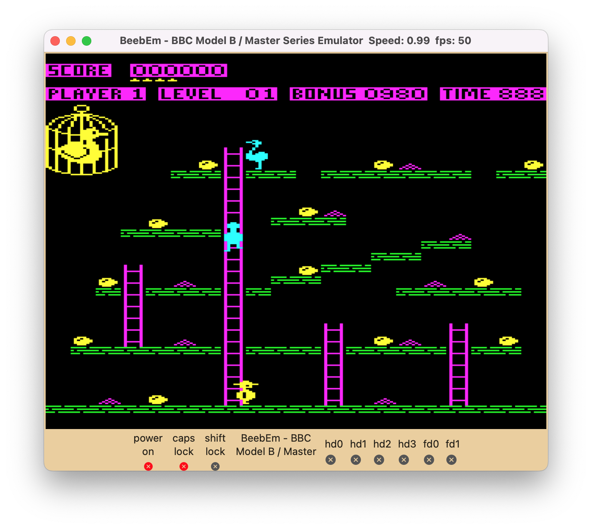

BeebEm for Apple Mac
====================

BeebEm is a BBC Micro and Master Series emulator. It enables you to run BBC Micro software on your Apple Mac. BeebEm was first developed for Unix systems in 1994 by [Dave Gilbert](http://www.treblig.org/) and was then ported to Microsoft Windows and **now** Apple Mac.  BeebEm-mac will run on any Apple Mac with MacOS 10.13+ (High Sierra).

<p align="center">
  <a href="https://github.com/commandercoder/beebem-mac"></a>
</p>

The hardware emulated by BeebEm is that of a standard BBC Micro Model B, a Model B with IntegraB board, Model B Plus or Master 128. Optional 65C02 and other types of second processor are also emulated. The emulation is accurate enough to run most software.

Installing
----------

Binaries are available from the [Releases page](https://github.com/commandercoder/beebem-mac/releases/) in GitHub or from [Commander Coder's BeebEm homepage](https://www.commandercoder.com/beebem-mac).

For more information on how to use BeebEm, see the BeebEm help at Help/index.html.

Compiling
---------

The source code for BeebEm is available at https://github.com/commandercoder/beebem-mac.

If you want to compile BeebEm yourself then you will need XCode 13 or later. The following project files are included and can be found in `XCode/Project/`:

| File                                 | Description                       |
| ------------------------------------ | --------------------------------- |
| `BeebEm.xcodeproj`                   | XCode Project package folder      |

To build the distributions in BeebEm.dmg & BeebEm.zip, the repository uses the [create-dmg](https://github.com/create-dmg/create-dmg) submodule.

### Configuration

After installing XCode, use it to open `BeebEm.xcodeproj`.  The project should default to building a local app, but you can select your Apple developer account.

Now build.

### Distributions

To build a distribution, use **Archive** in XCode to create the application.  In the Organizer select **Distribute App** and then **Copy App**.  Save the beebem app to a distribution folder somewhere (say, `XCode/Installer/`).  From a Terminal, navigate to `XCode/Installer/` and run
```
   ./create_distribution.zsh <beebem_distribution_folder>
```
The dmg and zip file will be created after a couple of minutes.

### Other Operating Systems

This version of BeebEm will not compile on Unix systems. This may change at some point but for now if you want to run BeebEm on Unix please download a Unix specific version of BeebEm.

Credits
-------

Thanks to Dave Gilbert for originally creating BeebEm. There's an interview with Dave about the early development of BeebEm [on YouTube](https://www.youtube.com/watch?v=7D5Msu4zn-Q).

Thanks to Mike Wyatt for his contributions to BeebEm and for hosting the [BeebEm homepage](http://www.mkw.me.uk/beebem).

Thanks to the maintainers and contributors for its continued development: Alistair Cree, Bill Carr, Charles Reilly, Chris Needham, David Sharp, Daniel Beardsmore, Dominic Beesley, Greg Cook, Jon Welch, Jonathan Harston, Ken Lowe, Kieran Mockford, Laurie Whiffen, Mark Usher, Martin Mather, Mauro Varischetti, Mike Wyatt, Nigel Magnay, pstnotpd, Rich Talbot-Watkins, Richard Broadhurst, Richard Gellman, Rob O'Donnell, Robert Schmidt, Steve Inglis, Steve Insley, Steve Pick, Tadek Kijkowski, Theo Lindebaum, Tom Seddon.

This Apple Mac version was ported to MacOS usingSwift 5.6.1, C *(gnu11)*, and C++ *(GNU++17)* by Andrew Hague.

Copyright
---------

Copyright (C) 1994-2024 David Alan Gilbert and contributors.

License
-------

BeebEm is distributed under the terms of the GNU General Public License as described in [COPYRIGHT.txt](COPYRIGHT.txt).
